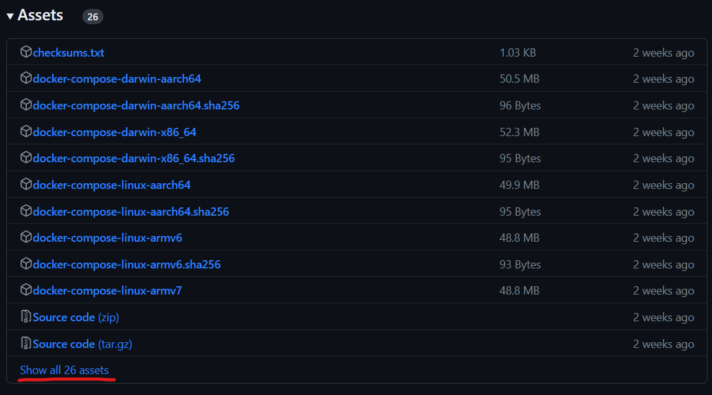

# DSO-Jenkins

This Setup is tested on `AWS EC2 Ubuntu 22.04 amd64`

<br>

## Setup
Follow the instructions below set up Jenkins with Docker

### 1. Update System Packages

First, update the system packages using the following command:

```bash
sudo apt update -y
```

### 2. Install Docker

To install Docker, run the following command:

```bash
sudo apt install docker.io -y
```

### 3. Add User to the Docker Group

Add your username to the Docker group to avoid using `sudo` for Docker commands. Replace `<username>` with your actual username. Execute the following command:

```bash
sudo usermod -aG docker <username>
```

After executing the command, log out and log in again to reflect the group changes.

### 4. Install Docker Compose

Follow the steps below to install Docker Compose:

- Go to the [Docker Compose releases](https://github.com/docker/compose/releases) page.
- Copy the link for the `docker-compose-linux-x86_64` bundle. If the bundle is not visible, click on "Show all assets" to find it.
- 
- Run the following command to download Docker Compose:

```bash
# sudo curl -L <bundle-link> -o /tmp/docker-compose

sudo curl -L https://github.com/docker/compose/releases/download/v2.18.1/docker-compose-linux-x86_64 -o /tmp/docker-compose
```

- Make the downloaded file executable:

```bash
sudo chmod +x /tmp/docker-compose
```

- Move the Docker Compose binary to the `/usr/local/bin` directory:

```bash
sudo mv /tmp/docker-compose /usr/local/bin
```

- Verify the installation by running the following command:

```bash
docker-compose version
```

### 5. Clone the Git Repository

Clone the Jenkins Git repository using the following command:

```bash
git clone https://github.com/deepak-chouhan/DSO-Jenkins.git
```

Navigate to the `Jenkins` directory within the cloned repository:

```bash
cd DSO-Jenkins/Jenkins/
```

### 6. Execute Docker Compose

To start Jenkins using Docker Compose, execute the following command:

```bash
docker-compose up
```

Wait for a while to allow Jenkins to start up completely.

### 7. Access Jenkins

Once Jenkins is up and running, you can access it through your web browser using the following URL:

```
http://<instance ip>:8080
```

### 8. Install Docker Pipeline Plugin

To install the Docker Pipeline Plugin in Jenkins, follow the steps below:

- Navigate to "Manage Jenkins" on the Jenkins home page.
- Select "Manage Plugins" from the dropdown menu.
- In the "Available" tab, search for "Docker Pipeline Plugin".
- Check the box next to the plugin and click "Install without restart".
- Wait for the plugin installation to complete.
- After installation, restart Jenkins to apply the changes.

That's it! You have successfully set up Jenkins with Docker using the provided instructions. You can now start building and managing your projects with Jenkins.